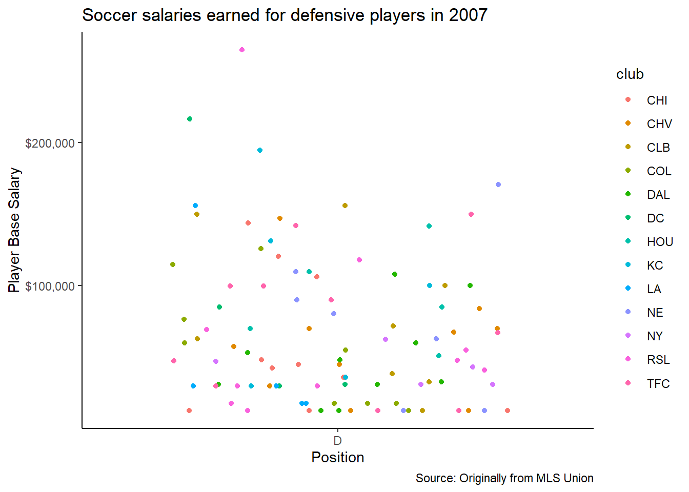

::: {.cell}

:::

::: {.cell}

:::

### Plot for all defenders in MLS League in 2007

::: {.cell}
::: {.cell-output-display}
{width=672}
:::
:::

This data shows the spread of salaries for defenders in 2007. The colors show the clubs each player was in, and the spread is wider than some might think. The highest salary for a defender during this time was almost $300,000.

### Plot for average defender salary in 2007

::: {.cell}
::: {.cell-output-display}
{width=672}
:::
:::

This data shows a graph for the average salary a defender had in 2007. This was approximately $65,000, which is less than average for offensive positions.

